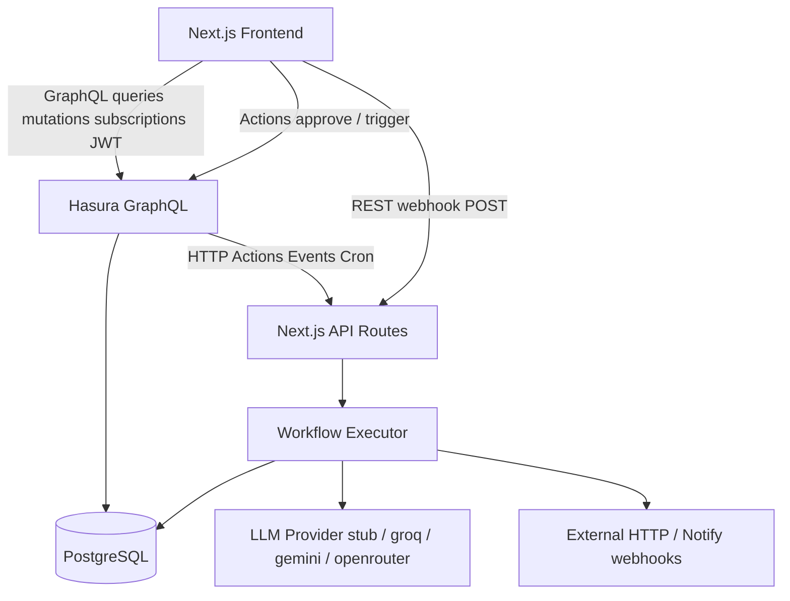

# AI Agent Workflow Builder

Multi-tenant, n8n-style AI workflow platform: build workflows with LLM, HTTP, branching, approval gates, and notify/db_write steps; run them with live GraphQL subscriptions; enforce org isolation, roles, and monthly quotas.

**Local default auth is demo mode (`AUTH_MODE=demo`). Nhost Cloud is not required for the local demo.** Nhost can be wired later via env (see [§6](#6-nhost-setup)).

---

## 1. Project overview

This app lets organization members:

- Create and edit workflows and ordered steps
- Trigger runs manually, via webhook, on a schedule, or from database events
- Watch step progress live (GraphQL subscriptions over Hasura)
- Pause at `approval_gate` and resume via a server-authorized Action
- Track monthly call quota (1 workflow run start = 1 call)

Stack layout:

| Layer | Responsibility |
| --- | --- |
| Next.js (App Router) | UI + API routes (Hasura Actions, events, webhooks, demo login) |
| Hasura | GraphQL API, permissions, Actions, Event Triggers, cron |
| PostgreSQL | Schema, seed data, `consume_org_quota` |
| Executor (`src/lib/executor`) | Authoritative run/step state, retries, LLM/HTTP/notify |

---

## 2. Architecture



ASCII equivalent:

```
Browser (Next.js UI)
   |  GraphQL (JWT role=user)
   v
Hasura ──► PostgreSQL
   | Actions / Event Triggers / Cron
   v
Next.js API routes ──► Executor ──► LLM / HTTP / Notify
                              └──► PostgreSQL (runs, steps, quota, audit)
```

Hasura Actions and events call the host Next.js process via `ACTION_BASE_URL` → `http://host.docker.internal:3000` (see `docker-compose.yml`). There is no separate Node worker container.

---

## 3. Tech stack

| Area | Choice |
| --- | --- |
| Frontend | Next.js 16, React 19, TypeScript, Tailwind CSS 4 |
| Auth (local) | `AUTH_MODE=demo` → `POST /api/auth/demo-login` signs Hasura JWTs (`jose`) |
| Auth (optional) | Nhost packages + `NEXT_PUBLIC_NHOST_*` when `AUTH_MODE=nhost` |
| API | Hasura GraphQL Engine v2.36 (`cli-migrations-v3`) |
| DB | PostgreSQL 15 |
| Client GraphQL | `graphql-request`, `graphql-ws` |
| Validation | Zod |
| LLM | Stub (default) or Groq / Gemini / OpenRouter |
| Tests | Vitest |
| Deploy target | Vercel-compatible Next.js + external Hasura/Postgres (e.g. Nhost) |

---

## 4. Database schema summary

Migrations live under `hasura/migrations/default/`:

1. `1730000000000_init` — schema + `consume_org_quota`
2. `1730000000001_seed` — demo orgs, members, workflow, webhook
3. `1730000000002_webhook_integrity` — webhook/trigger composite FK
4. `1730000000003_branch_and_triggers` — real branch jumps, db_write step, scheduled/DB-event seeds

| Table / object | Purpose |
| --- | --- |
| `organizations` | Tenant + `calls_used` / `calls_allowed` / `quota_period_start` |
| `org_members` | `owner` \| `editor` \| `viewer` (unique per org+user) |
| `workflows` | Org-scoped workflow definitions |
| `workflow_steps` | Ordered steps (`llm_call`, `http_request`, `db_write`, `notify`, `conditional_branch`, `approval_gate`) |
| `workflow_triggers` | `manual`, `webhook`, `scheduled`, `database_event` |
| `webhook_endpoints` | `path_token` + `secret` for HTTP webhooks |
| `workflow_runs` / `step_runs` | Execution state, attempts, approval fields |
| `workflow_db_writes` | Controlled key/payload writes (no arbitrary SQL) |
| `notifications` | Notify delivery log (+ event trigger) |
| `audit_logs` | Server-written audit trail |
| `watched_records` | Example table for DB-event triggers |
| `usage_events` | Per-consume audit of quota |
| `organization_monthly_usage` | View for quota UI |
| `consume_org_quota(org, run, reason)` | Atomic monthly consume |

---

## 5. Hasura setup

Local Hasura is started by Docker Compose using the **cli-migrations-v3** image, which applies `./hasura/migrations` and `./hasura/metadata` on startup.

- Console: http://localhost:8080
- Admin secret: `hasura-admin-secret` (local)
- JWT: HS256 key matching `HASURA_JWT_SECRET` / compose `HASURA_GRAPHQL_JWT_SECRET`
- Unauthorized role: `anonymous` (webhook Action allowed)
- Authenticated role: `user` (all table permissions)

Metadata includes:

- Tracked tables, relationships, select/insert/update/delete permissions
- Actions: `triggerWorkflowRun`, `approveStep`, `triggerWorkflowWebhook`
- Event triggers: `watched_records` → `/api/events/database-event`, `notifications` → `/api/events/notify`
- Cron: `scheduled_workflow_tick` every minute → `/api/events/scheduled`

Config reference: `hasura/config.yaml`.

---

## 6. Authentication modes (demo vs Nhost)

Authorization is **never** based on a frontend-selected persona name or org picker. Every GraphQL request and Action uses a verified JWT. Hasura derives `X-Hasura-User-Id` from JWT claims; row permissions join through `org_members.user_id = X-Hasura-User-Id`.

### Mode A — Local demo (`AUTH_MODE=demo`)

**Default for local development.** Does not require Nhost.

```env
AUTH_MODE=demo
DEMO_AUTH_PASSWORD=demo-password
HASURA_JWT_SECRET=local-jwt-secret-at-least-32-characters-long!!
```

- Login UI shows seeded personas (Alice…Frank).
- `POST /api/auth/demo-login` verifies the demo password and **server-signs** a Hasura JWT whose `x-hasura-user-id` is the seeded UUID (e.g. Alice → `aaaaaaaa-aaaa-…`).
- Choosing “Alice” cannot grant Bob’s or Org B’s access: the JWT subject is fixed at mint time; Hasura/Actions re-verify it.
- Demo login is **disabled** when effective mode is `nhost` (see below).

### Mode B — Nhost Auth (production)

When Nhost is configured:

```env
AUTH_MODE=nhost
NEXT_PUBLIC_NHOST_SUBDOMAIN=<your-subdomain>
NEXT_PUBLIC_NHOST_REGION=<region>
NEXT_PUBLIC_HASURA_GRAPHQL_URL=https://<nhost-or-hasura>/v1/graphql
HASURA_GRAPHQL_URL=https://<nhost-or-hasura>/v1/graphql
# RS256 (current Nhost asymmetric default): JWKS preferred
NHOST_JWT_JWKS_URL=https://<subdomain>.auth.<region>.nhost.run/v1/.well-known/jwks.json
# Or omit JWKS URL — auto-derived from NEXT_PUBLIC_NHOST_* in production/nhost mode
# Optional: NHOST_JWT_PUBLIC_KEY=<PEM public key only>
# HS256 only (local demo / symmetric Nhost):
# HASURA_JWT_SECRET=<symmetric key matching Hasura>
DATABASE_URL=<Nhost Postgres>
```

Behavior:

1. Login UI shows **only** Nhost email/password (no Alice/Bob buttons).
2. `@nhost/nhost-js` `signInEmailPassword` returns Nhost’s access token.
3. App calls `GET /api/auth/me` with that Bearer token to confirm the JWT verifies and to bind UI identity to the JWT subject.
4. GraphQL/subscriptions send **only** `Authorization: Bearer <token>` (never a client-forged `x-hasura-user-id`).
5. Hasura permissions and Actions resolve `org_members.user_id` against that JWT user id.

**Production force:** If `VERCEL_ENV=production` (or `FORCE_NHOST_AUTH=true`) **and** Nhost subdomain/region are set, demo mode is forced off even if `AUTH_MODE=demo` was left in env. Override only with `ALLOW_DEMO_AUTH=true` for exceptional local testing.

### Mapping Nhost users into organizations

After a real user signs up in Nhost, insert membership rows with **that** user’s UUID:

```sql
INSERT INTO org_members (org_id, user_id, role)
VALUES ('11111111-1111-1111-1111-111111111111', '<nhost-user-uuid>', 'editor');
```

Seeded demo UUIDs work only with demo JWTs.

### Probe endpoints

| Endpoint | Purpose |
| --- | --- |
| `GET /api/auth/mode` | `{ mode, demoEnabled, nhostConfigured }` for the login UI |
| `GET /api/auth/me` | Identity + memberships from **verified JWT** (not request body) |
| `POST /api/auth/demo-login` | Demo only; 403 when demo disabled |

### Cross-org isolation (unchanged, JWT-bound)

Guessing another org / workflow / run / step_run UUID cannot bypass RLS: every org-owned table filters through `organization.members.user_id = X-Hasura-User-Id` (or nested equivalent). Actions use the same JWT user id via `org_members` joins.

---

## 7. Environment variables

Copy `.env.example` → `.env.local` for Next.js.

| Variable | Client (`NEXT_PUBLIC_*`) | Server-only | Notes |
| --- | --- | --- | --- |
| `NEXT_PUBLIC_HASURA_GRAPHQL_URL` | ✓ | — | Browser GraphQL HTTP/WS |
| `NEXT_PUBLIC_APP_URL` | ✓ | — | Webhook curl examples in UI |
| `NEXT_PUBLIC_NHOST_SUBDOMAIN` | ✓ | — | Optional Nhost |
| `NEXT_PUBLIC_NHOST_REGION` | ✓ | — | Optional Nhost |
| `AUTH_MODE` | — | ✓ | `demo` (local) or `nhost` (production) |
| `ALLOW_DEMO_AUTH` | — | ✓ | `true` keeps demo on Vercel production (avoid) |
| `FORCE_NHOST_AUTH` | — | ✓ | `true` forces Nhost when subdomain/region set |
| `NHOST_JWT_JWKS_URL` | — | ✓ | RS256 JWKS (or auto from subdomain/region) |
| `NHOST_JWT_PUBLIC_KEY` | — | ✓ | Optional RS256 PEM public key |
| `DATABASE_URL` | — | ✓ | Executor Postgres pool |
| `HASURA_GRAPHQL_URL` | — | ✓ | Server GraphQL override |
| `HASURA_ADMIN_SECRET` | — | ✓ | Admin operations if needed |
| `HASURA_JWT_SECRET` | — | ✓ | HS256 demo / symmetric only |
| `ACTION_BASE_URL` | — | Docker/Hasura | Action/event webhook base |
| `ACTION_SHARED_SECRET` | — | ✓ | Optional Action header check |
| `HASURA_EVENT_SECRET` | — | ✓ | Optional event header check |
| `WEBHOOK_HMAC_SECRET` | — | ✓ | Documented default; seeded endpoint secret is `demo-webhook-secret` |
| `LLM_PROVIDER` | — | ✓ | `stub` \| `groq` \| `gemini` \| `openrouter` |
| `LLM_API_KEY` | — | ✓ | **Unset → stub mode** |
| `LLM_MODEL` | — | ✓ | Model id for real providers |
| `NOTIFY_WEBHOOK_URL` | — | ✓ | Notify step destination |
| `CRON_SECRET` | — | ✓ | Protects scheduled tick when set |
| `DEMO_AUTH_PASSWORD` | — | ✓ | Optional password for demo login |

Never expose admin secrets, JWT signing keys, or LLM keys to the browser.

---

## 8. Local installation

Prerequisites: Node.js 20+, npm, Docker Desktop (or compatible Compose).

```bash
cd ai-agent-workflow-builder
cp .env.example .env.local
npm install
docker compose up -d
```

Wait until Hasura is healthy (`http://localhost:8080/healthz`). Migrations and metadata apply automatically.

---

## 9. Database migration steps

Migrations are applied by the Hasura **cli-migrations-v3** container on startup:

```yaml
# docker-compose.yml (graphql-engine)
image: hasura/graphql-engine:v2.36.0.cli-migrations-v3
volumes:
  - ./hasura/migrations:/hasura-migrations
  - ./hasura/metadata:/hasura-metadata
```

Order:

1. `1730000000000_init` — tables, indexes, view, `consume_org_quota`
2. `1730000000001_seed` — demo data
3. `1730000000002_webhook_integrity` — webhook FK integrity
4. `1730000000003_branch_and_triggers` — branch jumps + extra demo triggers/steps

To reset local data:

```bash
docker compose down -v
docker compose up -d
```

(`-v` removes the Postgres volume and re-runs migrations/seed.)

---

## 10. Hasura metadata setup

Metadata under `hasura/metadata/` is applied with migrations by the same image. No manual console apply is required for a fresh `docker compose up`.

If you change metadata locally and use the Hasura CLI:

```bash
# optional, with Hasura CLI installed and hasura/config.yaml
cd hasura
hasura metadata apply --endpoint http://localhost:8080 --admin-secret hasura-admin-secret
```

Ensure `ACTION_BASE_URL` in Compose points at the running Next.js app (`host.docker.internal:3000` on Docker Desktop).

---

## 11. Seed data

Fixed UUIDs for reproducible demos:

| Org | ID | Members |
| --- | --- | --- |
| Organization A | `11111111-1111-1111-1111-111111111111` | Alice (owner), Bob (editor), Charlie (viewer) |
| Organization B | `22222222-2222-2222-2222-222222222222` | David (owner), Eve (editor), Frank (viewer) |

| Persona | Email | User ID | Role |
| --- | --- | --- | --- |
| Alice | `alice@org-a.demo` | `aaaaaaaa-aaaa-aaaa-aaaa-aaaaaaaaaaaa` | owner |
| Bob | `bob@org-a.demo` | `bbbbbbbb-bbbb-bbbb-bbbb-bbbbbbbbbbbb` | editor |
| Charlie | `charlie@org-a.demo` | `cccccccc-cccc-cccc-cccc-cccccccccccc` | viewer |
| David | `david@org-b.demo` | `dddddddd-dddd-dddd-dddd-dddddddddddd` | owner |
| Eve | `eve@org-b.demo` | `eeeeeeee-eeee-eeee-eeee-eeeeeeeeeeee` | editor |
| Frank | `frank@org-b.demo` | `ffffffff-ffff-ffff-ffff-ffffffffffff` | viewer |

Org A seeded workflow **Demo Approval Pipeline** (`aaaaaaaa-0000-4000-8000-000000000001`):

1. `llm_call` — classify sentiment (stub returns `POSITIVE` for the seeded prompt)  
2. `conditional_branch` — `text contains POSITIVE` → `true_next: next`; on `NEGATIVE` jumps to approval (`false_next`) and **skips** HTTP (`step_run.status = skipped`)  
3. `http_request` — `https://jsonplaceholder.typicode.com/todos/1`  
4. `approval_gate` — pauses for owner/editor approval (survives refresh)  
5. `db_write` — controlled insert into `workflow_db_writes` (owner-configured; no arbitrary SQL)  
6. `notify` — Slack-compatible webhook via `NOTIFY_WEBHOOK_URL`, or **stub** (row logged, no external call) when unset

Also seeded (disabled by default): `scheduled` (`interval_minutes: 60`) and `database_event` (`watched_records`) triggers — enable in Hasura/UI when testing those paths.

Webhook: path token `demo-org-a-webhook`, secret `demo-webhook-secret`.  
Quota: 50 calls/month per org (seed); enforced atomically by `consume_org_quota` at run start (1 run = 1 call).

---

## 12. Running frontend

```bash
npm run dev
```

Open http://localhost:3000 → login personas → dashboard / workflows.

Production-style local serve:

```bash
npm run build
npm start
```

---

## 13. Running backend functions

There is **no separate backend process**. Executor, Actions, webhooks, and events are Next.js App Router API routes in the same `npm run dev` / `npm start` process:

| Route | Role |
| --- | --- |
| `POST /api/auth/demo-login` | Demo JWT issuance |
| `POST /api/actions/trigger-workflow` | Hasura Action `triggerWorkflowRun` |
| `POST /api/actions/approve-step` | Hasura Action `approveStep` |
| `POST /api/actions/trigger-webhook` | Hasura Action `triggerWorkflowWebhook` |
| `POST /api/webhooks/[pathToken]` | Direct HTTP webhook |
| `POST /api/events/database-event` | Hasura event on `watched_records` |
| `POST /api/events/scheduled` | Hasura cron tick |
| `POST /api/events/notify` | Notification side-effect hook |
| `GET /api/health` | Health check |

Keep Next.js running before triggering Actions/events from Hasura.

---

## 14. LLM configuration

**Stub mode is available and is the default when `LLM_API_KEY` is unset** (or `LLM_PROVIDER=stub`). The stub adds a short artificial delay and returns `POSITIVE` / `NEGATIVE` from simple keyword heuristics — enough for the seeded conditional branch demo. It does **not** claim an external API was called (`stub: true` in step output).

For a real provider:

```env
LLM_PROVIDER=groq          # or gemini | openrouter
LLM_API_KEY=your_key_here
LLM_MODEL=llama-3.1-8b-instant
```

Effective provider resolution is in `src/lib/env.ts` (`effectiveLlmProvider`). Keys are server-only.

### Step types (executor)

| Type | Behavior |
| --- | --- |
| `llm_call` | Real provider or stub; retries once; stores input/output/error/attempt_count |
| `http_request` | GET/POST/PUT/PATCH/DELETE; timeout; SSRF guards; retry once on failure / 5xx |
| `conditional_branch` | Safe operators only (`contains`, `eq`, …); `true_next` / `false_next` = `next` \| `end` \| step UUID \| position |
| `approval_gate` | Pauses run + step; resume via `approveStep` Action |
| `db_write` | Inserts `{key, payload}` into `workflow_db_writes` only (owner) |
| `notify` | POST to `NOTIFY_WEBHOOK_URL` / config destination, or stub if unset (owner) |

### Notify stub

When no destination resolves (`NOTIFY_WEBHOOK_URL` unset and no step destination), the step inserts a `notifications` row with `status = stub` and completes successfully without an outbound HTTP call.

---

## 15. Webhook usage

Seeded Org A endpoint:

```bash
curl -X POST http://localhost:3000/api/webhooks/demo-org-a-webhook \
  -H "X-Webhook-Secret: demo-webhook-secret" \
  -H "Content-Type: application/json" \
  -d "{\"source\":\"demo\"}"
```

Requirements: Next.js up, Hasura/Postgres up, workflow active, trigger enabled, org quota remaining. Response includes the new `workflow_runs.id`.

Alternatively, Hasura Action `triggerWorkflowWebhook(path_token, payload)` hits `/api/actions/trigger-webhook` (anonymous + user roles in metadata).

---

## 16. Testing

```bash
npm test              # vitest unit + security integration (skips if Hasura/DB down)
npm run typecheck     # tsc --noEmit
npm run lint          # eslint
npm run build         # production Next.js build
```

Security integration tests (`tests/security.integration.test.ts`) cover cross-org isolation, viewer/editor restrictions, webhook-trigger ownership, ID guessing, and quota exhaustion against live Hasura when available.

---

## 17. Security model (two layers)

**Layer 1 — Organization isolation (Hasura permissions)**  
Every readable/writable resource is filtered through `org_members` so `user_id = X-Hasura-User-Id`. Cross-org queries return empty / null; guessing Org A IDs as Org B yields no rows.

**Layer 2 — Step / trigger privilege**  
Sensitive step types and webhook triggers are restricted in Hasura permission checks:

- Only **owner** may insert/update `db_write` and `notify` steps  
- Only **owner** may create `webhook` triggers / manage webhook endpoints  
- Editors may create other step types and non-webhook triggers  
- Viewers are read-only (cannot update workflows or call `triggerWorkflowRun`)

**Actions add a third enforcement point** for execution and approval: membership + role are re-checked in Next.js against Postgres (`getWorkflowAccess` / `getStepRunAccess`). Approval is **not** a client-trusted Hasura update on `step_runs`.

---

## 18. Approval gate architecture

1. Executor reaches `approval_gate` → step_run `paused`, workflow_run `paused`, execution stops.  
2. UI receives pause via subscription (`LiveRunView`) and shows “Awaiting approval”.  
3. Authorized user calls Hasura Action `approveStep(step_run_id)`.  
4. Handler verifies JWT/session user, org membership, `allowed_roles` on the step config, paused state; records `approved_by` / `approved_at`.  
5. `resumeWorkflowRun` continues from the next step.  
6. Approval is idempotent if already approved.

Default allowed roles: `owner`, `editor` (overridable in step config).

---

## 19. Quota architecture

- **1 run start = 1 call** (manual, webhook, scheduled, or database_event).  
- Consumption happens in the same DB transaction that creates the run, via `consume_org_quota(org_id, run_id, reason)`.  
- Function resets the period when `quota_period_start` is before the current month, then atomically `UPDATE ... SET calls_used = calls_used + 1 WHERE calls_used < calls_allowed`.  
- On success, inserts `usage_events`. On failure, returns false → API `429` / GraphQL error; run marked failed.  
- Frontend `QuotaIndicator` is informational only; enforcement is server-side.

---

## 20. Deployment instructions

1. Provision PostgreSQL + Hasura (Nhost or self-hosted).  
2. Apply the same migrations/metadata from `hasura/`.  
3. Deploy Next.js where Hasura can reach Action/event URLs (public HTTPS).  
4. Set production env vars (GraphQL URLs, JWT secret aligned with Auth, `DATABASE_URL`, LLM keys if used, `ACTION_SHARED_SECRET`, `HASURA_EVENT_SECRET`, `CRON_SECRET`).  
5. Point Hasura `ACTION_BASE_URL` / action handlers at `https://<your-app>`.  
6. Confirm `npm run build` succeeds before go-live.

Do not hardcode `localhost` in production env values.

---

## 21. Vercel deployment (GitHub → Vercel → Nhost/Hasura)

Full step-by-step: [`docs/deployment.md`](docs/deployment.md). Checkbox list: [`docs/deployment-checklist.md`](docs/deployment-checklist.md). Production readiness matrix: [`docs/production-readiness-audit.md`](docs/production-readiness-audit.md).

Recommended path:

1. **GitHub** — push this repository.  
2. **Vercel** — Import project; Framework Preset Next.js; set Environment Variables from `.env.example` (production values).  
3. **Nhost / Hasura** — host Postgres + Hasura; apply `hasura/migrations` + `hasura/metadata`; set Action/event webhooks to `https://<vercel-domain>/api/...`.  
4. Align JWT: Nhost Auth JWTs must be accepted by Hasura; Next.js `HASURA_JWT_SECRET` (or JWKS config) must verify the same tokens if you verify on the server.  
5. Set `AUTH_MODE=nhost` and `NEXT_PUBLIC_NHOST_*` when using Nhost Auth; keep `AUTH_MODE=demo` only for non-production demos.  
6. Redeploy Vercel after Hasura URLs are final; smoke-test Action trigger + webhook + subscription.

Local Docker Compose remains the supported path for reviewers without cloud accounts.

---

## 22. Final demo walkthrough

With `docker compose up -d`, `.env.local` from `.env.example`, and `npm run dev`:

1. **Log in as Organization A owner** — open http://localhost:3000/login, choose Alice (`alice@org-a.demo`).  
2. **Open Org A workflow** — Dashboard → Workflows → **Demo Approval Pipeline**. Confirm steps, triggers, and quota indicator.  
3. **Run manually** — click Run (owner/editor).  
4. **Watch live updates** — open the run page; subscription should show LLM → HTTP → conditional → approval paused.  
5. **Conditional path** — seeded prompt yields stub `POSITIVE`; branch label should show the positive path.  
6. **Paused at approval** — UI shows awaiting approval; later steps not executed yet.  
7. **Approve** — as Alice (or Bob); click Approve (`approveStep` Action).  
8. **Resume without full page reload** — subscription moves run back to running then completed.  
9. **Workflow completes** — notify step runs; run status `completed`.  
10. **Webhook start** — without clicking Run:

```bash
curl -X POST http://localhost:3000/api/webhooks/demo-org-a-webhook \
  -H "X-Webhook-Secret: demo-webhook-secret" \
  -H "Content-Type: application/json" \
  -d "{\"source\":\"demo\"}"
```

11. **Org B isolation** — log in as David (`david@org-b.demo`). Attempt to view/trigger/approve/subscribe to Org A resources and guess Org A UUIDs via GraphQL; all must fail or return empty.

Optional: leave `LLM_API_KEY` empty to stay in stub mode for a reliable offline demo.

---

## Additional docs

- [Technical write-up](docs/technical-writeup.md)  
- [Final audit](docs/final-audit.md)  
- [Security notes](docs/SECURITY.md)  
- [Implementation plan](docs/IMPLEMENTATION_PLAN.md)  
